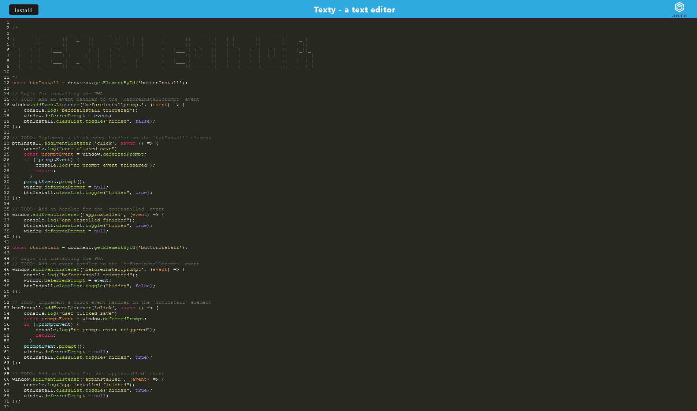

# Texty
```
 _______  _______  __   __  _______  __   __      _______  ______   ___   _______  _______  ______   
|       ||       ||  |_|  ||       ||  | |  |    |       ||      | |   | |       ||       ||    _ |  
|_     _||    ___||       ||_     _||  |_|  |    |    ___||  _    ||   | |_     _||   _   ||   | ||  
  |   |  |   |___ |       |  |   |  |       |    |   |___ | | |   ||   |   |   |  |  | |  ||   |_||_ 
  |   |  |    ___| |     |   |   |  |_     _|    |    ___|| |_|   ||   |   |   |  |  |_|  ||    __  |
  |   |  |   |___ |   _   |  |   |    |   |      |   |___ |       ||   |   |   |  |       ||   |  | |
  |___|  |_______||__| |__|  |___|    |___|      |_______||______| |___|   |___|  |_______||___|  |_|

```
A Simple text editor web app designed to work online and offline using service workers via the workbox-webpack plugin. It uses indexDB to store the content of the editor between user sessions.

[Deployed application](https://protected-fortress-28659.herokuapp.com/)

